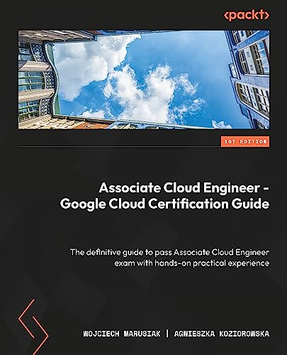

# Google Cloud Associate Cloud-Engineer Certification and and Implementation-Guide
Google Cloud Associate Cloud Engineer Certification and and Implementation Guide, Published by Packt Publishing

Welcome to the GitHub repository for the book "Associate Cloud Engineer - Google Cloud Certification Guide"!

This book is designed to help you prepare for the Google Cloud Associate Cloud Engineer certification exam. The book covers all of the topics that are covered on the exam, and it includes practice questions and answers.

In addition to the book, we will also be providing answers to two mock chapters on the GitHub repository. These mock chapters will give you a chance to practice your skills and see how you would do on the exam.

We hope that you find this repository helpful. If you have any questions, please feel free to post them in the Issues section.

Thanks, 
The Authors - Agnieszka and Wojciech

If you don't have the book yet, feel free to purchase it - for example from Amazon [ACE Book on Amazon](https://www.amazon.com/Associate-Cloud-Engineer-Certification-hands-ebook/dp/B0CB68K33C/).